# Basketball Analytics and AI Scouting System

Opponent scouting for the Israeli Basketball Premier League. Pick an opponent,
read a scouting report built from a full season of official play-by-play,
download it as a PDF.

The design principle, and the reason to trust the output:

> **Deterministic code calculates. Agents interpret.**

Every number in every report is computed in Python from play-by-play. A
constrained three-agent pipeline selects which evidence matters, explains it and
prioritizes it — and writes no numbers at all, because its schemas have nowhere
to put one.

**Live:** https://web-production-82a60.up.railway.app

```mermaid
flowchart LR
  PBP[Official play-by-play<br/>297 games cached] --> STATS[Deterministic analytics<br/>possession engine · four factors<br/>league context · W/L · segments]
  STATS --> PACK[(Versioned EvidencePack<br/>14 teams · hash-checked)]

  PACK --> A1[Evidence Triage<br/>keep 8-12 signals]
  A1 --> A2[Tactical Scout<br/>signals to tendencies]
  A2 --> A3[Head Scout<br/>report + Keys to Win]

  A3 --> VAL{Deterministic<br/>validation<br/>R1-R18}
  VAL -- reject --> A3
  VAL -- pass --> RENDER[Render: numbers re-attached<br/>from the pack, not the model]

  RENDER --> DB[(Supabase)]
  DB --> WEB[FastAPI + Jinja<br/>public site]
  DB --> PDF[PDF]

  classDef det fill:#eaeff3,stroke:#1b4965,color:#12181d;
  classDef agent fill:#fff,stroke:#8a939e,stroke-dasharray:4 3,color:#12181d;
  class PBP,STATS,PACK,VAL,RENDER,DB,WEB,PDF det;
  class A1,A2,A3 agent;
```



Solid boxes are deterministic and authoritative. Dashed boxes are the agents:
they choose and explain, and the numbers are re-attached from the pack after
they are done.

---

## Status

| Stage | State |
|---|---|
| PBP ingestion (297 games cached, 182 team-game records) | Complete |
| Deterministic analytics — possession engine, four factors, league context, W/L signals, segments | Complete, validated |
| Agent layer — 3 CrewAI agents, validation, rendering | Complete, live-verified |
| Production evidence packs (14 teams, in Git) | Complete |
| FastAPI + repository + Supabase persistence | Complete, live-verified |
| PDF + web frontend | Complete — "Scouting Desk" design, responsive, verified at 1280px and 375px |
| Reports for all 14 opponents | Generated and persisted |
| CI | Passing |
| Railway deployment | **Live** — https://web-production-82a60.up.railway.app |
| Video analytics | **Prototyped, evaluated, and deliberately excluded** — see below |

### About the video layer

Video analytics were built and taken seriously: PBP-to-broadcast clock
calibration, Gemini multimodal classification of localized shot events,
structured aggregation, and a fresh-game evaluation. The evaluation found
reliability and generalization insufficient for a product that puts numbers in
front of a coach, so the feature was **cut rather than shipped**. The report
declares the absence explicitly instead of implying capability.

---

## Documentation

| Document | Covers |
|---|---|
| [`docs/ARCHITECTURE.md`](docs/ARCHITECTURE.md) | The full path, the layering rules, why the numbers cannot be wrong |
| [`docs/SECURITY.md`](docs/SECURITY.md) | Threat model, controls, and what is out of scope |
| [`docs/DEPLOYMENT.md`](docs/DEPLOYMENT.md) | Railway, Supabase, environment variables, generation |
| [`artifacts/stitch_handoff/README.md`](artifacts/stitch_handoff/README.md) | Frontend design handoff — screens, contracts, hard constraints |
| [`PROJECT_SPEC.md`](PROJECT_SPEC.md) | Agreed product design |
| [`BUILD_PLAN.md`](BUILD_PLAN.md) | Build order and risk gates |
| [`WORKLOG.md`](WORKLOG.md) | What each session did |
| [`CLAUDE.md`](CLAUDE.md) | Operating instructions for Claude Code sessions |

---

## Setup

```powershell
python -m venv .venv
.venv\Scripts\python.exe -m pip install -r requirements.txt

copy .env.example .env      # then fill in what you need
```

Nothing in `.env` is required to run the tests.

```powershell
.venv\Scripts\python.exe -m pytest
```

The suite passes with **no credentials and no network**.

---

## Running the app

```powershell
python main.py                              # http://127.0.0.1:8000
# or
uvicorn main:app --host 0.0.0.0 --port 8000
```

| Route | Auth | Purpose |
|---|---|---|
| `GET /` | — | League dashboard: KPIs, ORtg×DRtg scatter, advanced table |
| `GET /teams/{team_id}` | — | Team analytics — Overview |
| `GET /teams/{team_id}/{tab}` | — | `splits` · `quarters` · `situations` · `profile` · `games` |
| `GET /explore` | — | Outcome × one segment, all 14 teams ranked |
| `GET /games` | — | 364 team-game rows, sortable and filterable |
| `GET /compare` | — | Two teams aligned, `?a=&b=` |
| `GET /scouting/{team_id}` | — | The AI scouting report |
| `GET /methodology` | — | Every metric, filter, threshold and limitation |
| `GET /reports/{report_id}` | — | Report permalink |
| `GET /health` | — | Liveness + configuration snapshot |
| `GET /api/teams` | — | The 14 supported opponents |
| `GET /api/reports/latest/{team_id}` | — | Latest saved report |
| `GET /api/reports/{report_id}` | — | One saved report |
| `GET /api/reports/{report_id}/pdf` | — | PDF of a saved report |
| `POST /api/admin/reports/generate` | `X-Admin-Token` | Generate, validate and save |
| `GET /api/docs` | — | OpenAPI UI |

**No public route calls Gemini.** Reads come from storage and the PDF is
rendered from a stored report, so browsing the site costs nothing. Generation is
one admin-only endpoint.

Without Supabase configured the app still boots and serves an honest empty
state, using in-memory storage and logging a warning.

---

## How the agent output is kept honest

The prompt is how good output is obtained; the validator is how it is
guaranteed. Every rule is a pure function over `(pack, agent output)` in
`agents/validation.py`, so the whole thing is exercisable offline with
synthetic input — no model, no key, no network.

A rejection is fed back to the agent once, with the specific finding. A second
failure raises rather than emitting a partially-valid report.

| | Rejects |
|---|---|
| **R1–R2** | Dangling or unavailable evidence ids |
| **R3–R4** | Metrics this pipeline doesn't compute; player, scheme or video claims |
| **R5, R7** | Uncited claims; signal and recommendation counts outside their bands |
| **R6** | Win/loss framing for a team whose record is too lopsided to support it |
| **R9** | A degree word ("elite", "exceptional") the cited evidence doesn't reach |
| **R10** | Causal language about what is only a win/loss correlation |
| **R11** | Half-court, "by design", shot-contest — evidence that does not exist here |
| **R12** | A tactic citing evidence its own Key to Win does not rest on |
| **R13** | "Stable"/"unchanged" contradicted by a large win/loss effect |
| **R14** | Rhythm, intensity, momentum — constructs nothing here measures |
| **R15** | "Early"/"late" without matching first-half or clutch evidence |
| **R16** | An objective about their offence backed only by defensive metrics |
| **R17** | A technique in the objective, where a measurable outcome belongs |
| **R18** | Internal claim-strength vocabulary leaking into coach-facing prose |

Two further rules are absent because the schema makes them impossible rather
than detectable — the preferred approach wherever it is available. The head
scout cites implication ids and never evidence ids, so it structurally cannot
introduce new evidence; and no agent schema has a numeric field, so no agent
can state a number. Likewise a Key to Win carries at most two tactics because
`max_length=2` refuses a third before validation is ever reached.

Claim strength and confidence are re-derived in Python from provenance and
reliability, and can only be lowered — never raised — from what the model
proposed. The coach sees the resolved value.

---

## Generating reports

```powershell
# one team, through the same path the API uses
python scripts\ops\generate_reports.py --team-id segev:4

# see the plan for the whole league without spending anything
python scripts\ops\generate_reports.py --all --dry-run

# rehearse the entire chain offline with deterministic stub agents
python scripts\ops\generate_reports.py --all --stub
```

Roughly 3 provider calls and 2–3 minutes per report. Existing reports are not
regenerated unless `--force` is given, and `--all` refuses to run against a real
provider without `--yes`.

Afterwards, sweep the league for prose that looks like something the validator
is meant to prevent:

```powershell
python scripts\ops\qa_reports.py
```

Read-only, no provider call. It is deliberately over-broad — it matches words,
whereas the real rules match words *against the cited evidence*, so it cannot
tell an earned "elite" from an unearned one. Treat a finding as a question,
confirm it against the rule, and only then regenerate.

---

## Rebuilding the deterministic evidence

`data/raw` and `data/processed` are git-ignored, so the production path reads
committed, hash-checked evidence pack artifacts instead
(`data/evidence_packs/`, 14 teams, ~600 KB). Rebuild them after any change
upstream of the agent layer:

```powershell
python scripts\scouting_report\build_production_packs.py
python scripts\scouting_report\build_production_packs.py --check   # verify only
```

---

## Known limitations

Stated here rather than discovered later. The product declares most of these to
the coach as well, in its Data Limits section.

**Team-level only.** No player, lineup or pass-tracking data, so no individual
matchup advice. This is a property of the source, not a missing feature.

**No video-derived anything** — shot contests, shot creation, on-ball pressure.
Prototyped, evaluated, cut (above).

**No scheme, coverage or coaching intent.** Play-by-play does not record it, and
the validator rejects claims that pretend otherwise.

**Situational splits are small.** Clutch and trailing segments rest on subsets
of a 26-game season and are directional rather than precise. The evidence cards
carry their own sample size and reliability tier so this is visible per metric,
not buried in a footnote.

**A win/loss split is a correlation.** Two subsets of the same team's games,
grouped by an outcome many other things also affected. R10 rejects causal
phrasing, and for a team whose record is too lopsided to compare — Maccabi Tel
Aviv at 22-4 — the deterministic layer withholds the split entirely and the
report says so instead of guessing.

**One season, one league, 14 teams.** League-relative ranks mean "of these 14".

**The prose is model-written.** Every number is not: values, ranks, averages and
samples are attached by the renderer from the pack after the agents are done.
The validator constrains what the prose may claim, but it is a set of rules, not
a comprehension check — a sentence can satisfy all eighteen and still read
awkwardly. `scripts/ops/qa_reports.py` exists for exactly that sweep.

**Reports are snapshots.** They are generated on demand and stored; nothing
refreshes them when new games land. Re-run the generator.

---

## Layout

```
src/basketball_scout/
  config.py · net.py       environment settings; OS trust store
  pbp/                     source parsing behind a canonical schema
  stats/                   all analytics — the only source of a number
  agents/                  evidence pack, prompts, 3 agents, validation, render
    pack_store.py          versioned, hash-checked production artifacts
    crew.py                the only provider-aware module in the project
  reports/                 public contract, PDF, generation service
  web/                     FastAPI, templates, static
  video/                   the excluded video spike (kept runnable, not shipped)
scripts/
  ops/                     supabase_admin.py · generate_reports.py
  scouting_report/         build_pack.py · build_production_packs.py · generate_report.py
  spikes/                  diagnostic harnesses
supabase/migrations/       reproducible schema + seed
data/evidence_packs/       TRACKED — what a deployment actually runs on
data/validation/           TRACKED — small fixtures for reproducible tests
data/raw · data/processed  git-ignored
tests/                     offline suite
```

---

Secrets live in `.env` (git-ignored). `.env.example` holds empty placeholders
only. Never commit a key.
