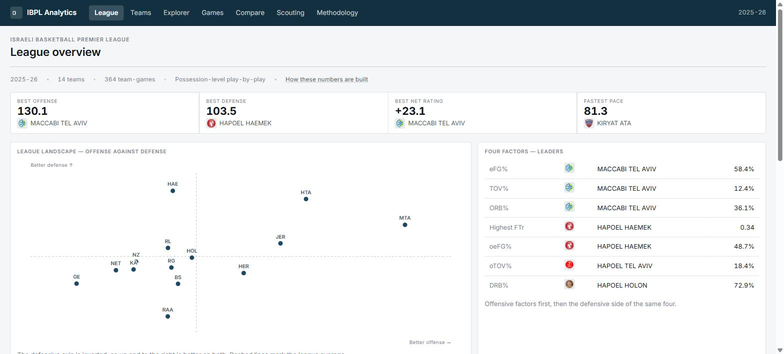
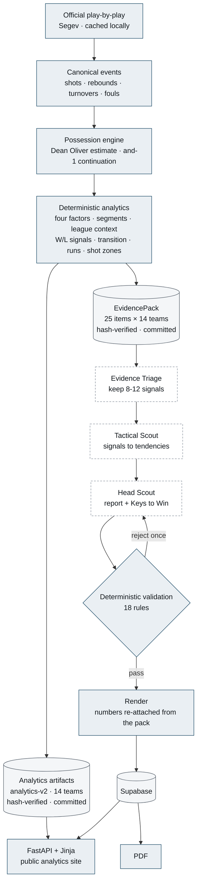
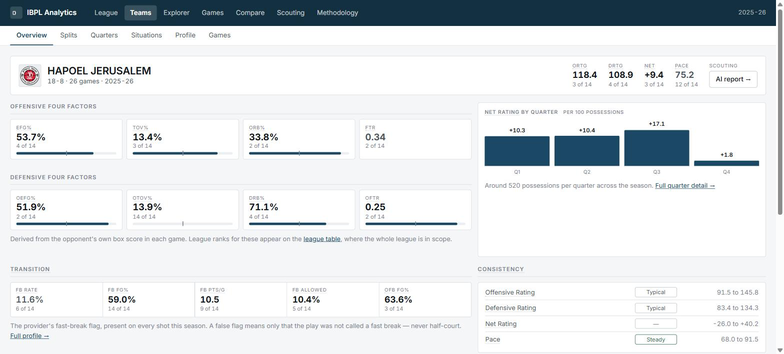
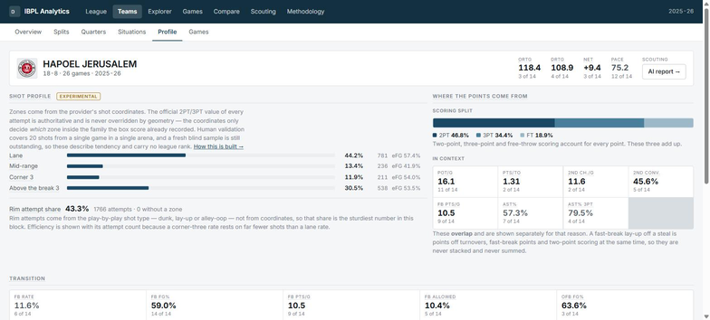
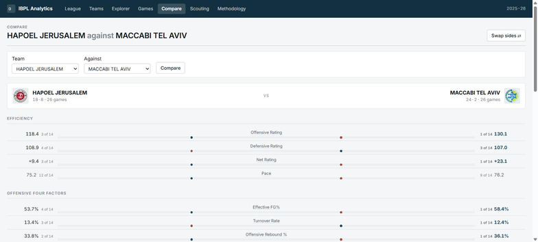
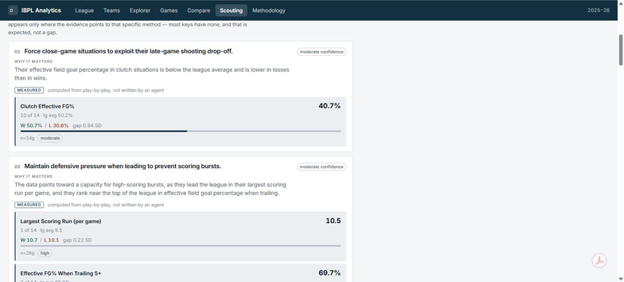
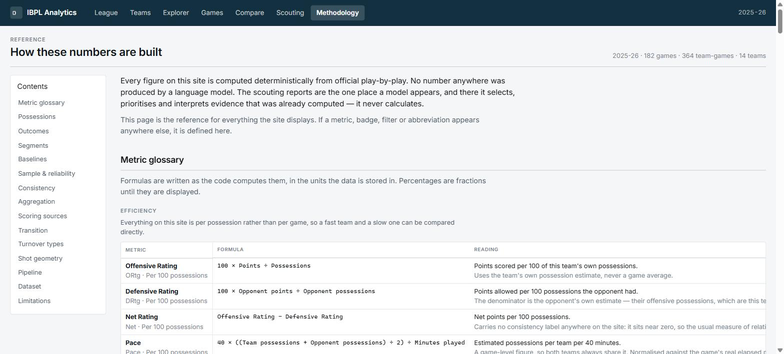

# IBPL Analytics — Basketball Analytics and AI Scouting

An advanced basketball analytics platform for the Israeli Basketball Premier League,
built from a full season of official play-by-play, with AI-generated opponent scouting
reports layered on top of it.

### ▶ **Live: https://web-production-82a60.up.railway.app**

**Release** `v1.0.0-mvp` · 2025-26 regular season · 182 games · 364 team-game records ·
14 teams · 1,205 tests, all offline



---

## The principle everything else follows from

> **Deterministic code calculates. Agents interpret.**

Every number on the site and in every report is computed in Python from play-by-play.
The three-agent pipeline chooses which evidence matters, explains it and prioritises it —
and writes no numbers at all, because its schemas have nowhere to put one. After the
agents finish, values, ranks, league averages and sample sizes are re-attached by the
renderer from the evidence pack.

Browsing the site never invokes a language model. Report generation is a single
admin-only endpoint.

---

## The problem

A coach preparing for an opponent has the box score and the standings. What they want is
the shape of a team: how it scores, where it shoots from, what happens when it trails,
what it does in the last five minutes, and which of those things actually separates its
wins from its losses.

That is all derivable from play-by-play, and almost none of it is published anywhere for
this league. This project derives it, publishes it as a browsable analytics site, and
then uses a constrained agent pipeline to turn the strongest signals into a readable
scouting report — without ever letting the model near the arithmetic.

**Source data.** Official Segev play-by-play, cached locally. The site is built on the
182 accepted 2025-26 regular-season games — 14 teams, 26 games each, 364 team-game
records. The cache also holds 115 cup, playoff, preseason, second-division, youth and
women's fixtures, which are deliberately excluded.

---

## What you can do on the site

| Surface | What it answers |
|---|---|
| **League** | Who is good, and how? KPI strip, offense-against-defense scatter, Four Factors leaders, sortable advanced table |
| **Team → Overview** | Identity at a glance: both halves of the Four Factors, net rating by quarter, transition, consistency, and what changes between wins and losses |
| **Team → Profile** | Where a team shoots from, where its points come from, what kind of turnovers it makes, how its scoring runs |
| **Team → Splits / Quarters / Situations** | Wins against losses; period by period; close, leading, trailing and clutch |
| **Team → Games** | All 26 games with per-game efficiency, factors and score dynamics |
| **Explorer** | One outcome × one segment, all 14 teams ranked, with each team measured against its own baseline |
| **Games** | All 364 team-game rows, sortable and filterable |
| **Compare** | Two teams aligned metric by metric, with league position beside every value |
| **Scouting** | The AI report for one opponent, with the deterministic evidence behind every claim |
| **Methodology** | Every metric, formula, filter, threshold and limitation the site uses |

Reports download as PDF.

---

## Architecture



Solid boxes are deterministic and authoritative. Dashed boxes are the agents. The two
artifact stores are committed to Git and hash-verified at load, so **a deployment runs on
verified artifacts and never touches raw play-by-play** — the raw cache is a build-time
input only.

---

## The deterministic layer

| Capability | Notes |
|---|---|
| **Efficiency** — ORtg, DRtg, Net Rating, Pace | Per 100 possessions, from a Dean Oliver possession estimate computed per team |
| **Four Factors, both sides** | eFG%, TOV%, ORB%, FT rate — and the opponent's four, run through the same functions so the two halves are comparable |
| **Outcome × segment grid** | 11 segments × 3 outcomes × 14 teams = 462 cells, each volume-weighted and stamped with its own sample state |
| **Situational splits** | Close, leading, trailing, clutch, quarters, halves — all assigned from the state at possession *start* |
| **Wins vs losses** | Effect sizes on actionable metrics; rating metrics are excluded as near-tautological |
| **Transition** | Provider fast-break flag, both directions — attempt rate, finishing, and what a team concedes |
| **Turnover taxonomy** | The provider's own ten categories, committed and forced |
| **Scoring sources** | The 2PT/3PT/FT partition, plus points off turnovers, second chance, fast break and assisted share as overlapping context |
| **Runs and droughts** | Runs made and conceded; scoring and field-goal droughts, which are not the same thing |
| **Stability** | Game-to-game spread per metric, withheld where the measure is meaningless |
| **League context** | Rank and percentile over the teams with a usable sample in the same cell |
| **Shot zones** | ⚠️ **Experimental** — four coarse zones from provider coordinates. Complete data, provisional validation. Never ranked, never coloured |

Every rate is volume-weighted: components are summed across the games in scope, then the
formula runs once. Sample size is displayed beside every filtered number, and a cell below
the floor renders a state rather than a value.

[Full methodology, with the formula for every metric →](https://web-production-82a60.up.railway.app/methodology)

---

## The agent pipeline

```
EvidencePack  →  Evidence Triage  →  Tactical Scout  →  Head Scout
                                                            ↓
                        saved report  ←  Supabase  ←  deterministic validation
```

Three CrewAI agents on Gemini, each with a narrow job:

- **Evidence Triage** keeps 8–12 signals from a pre-ranked candidate pool it may not add to.
- **Tactical Scout** turns kept signals into tactical implications.
- **Head Scout** writes the executive summary and the Keys to Win.

Then eighteen deterministic rules run as pure functions over `(pack, agent output)` — no
model, no key, no network — and a rejection is fed back once with the specific finding. A
second failure raises rather than emitting a partially valid report.

**Agents cannot introduce a number.** No agent schema has a numeric field, and the head
scout cites implication ids rather than evidence ids, so it structurally cannot introduce
new evidence. Claim strength and confidence are re-derived in Python from provenance and
reliability, and can only be lowered from what the model proposed.

Reports are **generated snapshots**, stored once. Nothing regenerates them when new games
land, and a public page view never triggers a provider call.

<details>
<summary>The eighteen validation rules</summary>

Seventeen reject; R8 is the audit trail that records a downgrade rather than refusing one.

| | What it catches |
|---|---|
| **R1–R2** | Dangling ids, and evidence declared unavailable being used as support |
| **R3** | A metric this pipeline does not compute |
| **R4** | Player or personnel claims (the dataset is team-level), scheme and coverage claims, video-adjacent language |
| **R5, R7** | Uncited claims; signal and recommendation counts outside their bands |
| **R6** | Win/loss framing for a team with no rankable win/loss evidence |
| **R8** | *(warning)* Records every claim-strength and confidence downgrade — the evidence that the model's proposal was only ever lowered |
| **R9** | A degree word ("elite", "exceptional") the cited evidence doesn't reach |
| **R10** | Causal language about what is only a win/loss correlation |
| **R11** | Half-court, possession-type, shot-contest, intentionality — evidence this dataset does not have |
| **R12** | A tactic citing evidence its own Key to Win does not rest on |
| **R13** | "Stable"/"unchanged" contradicted by a large win/loss effect |
| **R14** | Rhythm, intensity, momentum — constructs nothing here measures |
| **R15** | "Early"/"late" without matching first-half or clutch evidence |
| **R16** | An objective about their offence backed only by defensive metrics |
| **R17** | A technique in the objective, where a measurable outcome belongs |
| **R18** | Internal claim-strength vocabulary leaking into coach-facing prose |

</details>

---

## Screenshots

| | |
|---|---|
| <br/>**Team → Overview** — both halves of the Four Factors, net rating by quarter, transition, consistency | <br/>**Team → Profile** — shot zones (experimental), scoring sources, turnover types |
| <br/>**Compare** — two teams aligned, league position beside every value | <br/>**Scouting** — measured evidence under every interpreted claim |



*Methodology — every formula written as the code computes it, verified against the executing code by test.*

---

## Known limitations

Stated here rather than discovered later. The product declares most of these to the user
as well.

- **Team-level only.** No player, lineup or pass-tracking analytics. A property of the source, not a missing feature.
- **No lineup or on/off analysis.**
- **No scheme, coverage or coaching intent.** Play-by-play does not record it, and the validator rejects claims that pretend otherwise.
- **No video-derived analytics** in the released MVP — see below.
- **A false fast-break flag never means half-court.** Measured: 5.7% of the provider's negatives happen inside four seconds of a change of possession. No half-court figure exists anywhere on the site, and a test asserts the phrase appears nowhere except inside that denial on the methodology page.
- **Shot geometry is experimental.** Coordinate coverage is complete, but human validation is twenty labelled shots from a single game in a single arena, and the same twenty both diagnosed and confirmed the one rule change since. Zone shares are shown; shot charts and distances are not.
- **Shot distance is not production-grade** — roughly ±1 m, and never displayed.
- **Some situational samples are thin.** Clutch averages 7.8 possessions a game (4.9–12.1 across the fourteen teams). Crossed with wins or losses, not one of the 28 cells reaches `sufficient` — 15 are `limited` and 13 `insufficient`. The site states that per cell rather than in a footnote.
- **One season, one league, 14 teams.** A league rank means "of these 14".
- **A win/loss split is a correlation**, not a cause, and the validator rejects causal phrasing. Where a record is too lopsided to compare — Maccabi Tel Aviv at 24-2 — the comparison is withheld entirely and the page says why.
- **Reports are snapshots**, not automatically regenerated after new games.
- **The prose is model-written.** Every number is not.

---

## The video layer — prototyped, evaluated, excluded

A video analytics layer was built and taken seriously, and it was the *first* major stage
rather than the last — the riskiest unknown tested earliest, behind explicit gates:
play-by-play to broadcast clock calibration, Gemini multimodal classification of localised
shot events, structured aggregation, and a fresh-game evaluation at the end.

**Gate 5 returned REMOVE.** The fresh-game evaluation found reliability and generalisation
insufficient for a product that puts numbers in front of a coach, so the layer was **cut
rather than shipped**. Every report declares the absence explicitly through
`unavailable_evidence`, and the validator rejects video-adjacent language, so nothing
implies a capability that isn't there.

The spike stays runnable in `src/basketball_scout/video/`. The decision is recorded in
[`PROJECT_SPEC.md`](PROJECT_SPEC.md) (amendment A1) and the stage design in
[`docs/VIDEO_STAGE_PLAN.md`](docs/VIDEO_STAGE_PLAN.md).

This is an engineering validation decision, not a shipped capability — and the gate
working as designed is the point.

---

## Tech stack

**Python 3.11** · **FastAPI** · **Jinja2** + hand-written CSS + vanilla JS (no build step)
· **Pydantic** · **CrewAI** on **Gemini** · **Supabase** (Postgres) · **ReportLab** ·
**pytest** · **GitHub Actions** · **Railway**

Charts are hand-built inline SVG and CSS, rendered server-side. There is no npm, no
bundler and no frontend framework.

---

## Testing and validation

| Gate | State |
|---|---|
| Offline test suite | **1,205 tests — 1,203 pass, 2 conditionally skip.** None is network-marked: the entire suite runs with no credentials, no network and no provider |
| League completeness guard | Build refuses to publish unless 14 teams × 26 games are present |
| Season invariant | Turnover total pinned at 5,205; a wrong game population fails the build |
| EvidencePack hashes | All 14 recomputed and verified on every test run |
| Artifact integrity | Every analytics artifact hash-verified at load; an old version is refused, not half-loaded |
| No-provider guarantee | Every public route is served by an app whose agent backend raises if constructed |
| Report validation | 18 rules, exercised offline against synthetic agent output |
| Methodology anti-drift | Every displayed formula is evaluated against the executing code |
| Browser QA | 17 surfaces at 1440 / 1024 / 375 — no page-level horizontal scroll |
| CI | GitHub Actions green on the released commit |

```powershell
.venv\Scripts\python.exe -m pytest
```

---

## Running it locally

Requires **Python 3.11+**. No credentials are needed to run the tests or to browse the
analytics.

```powershell
python -m venv .venv
.venv\Scripts\python.exe -m pip install -r requirements.txt

copy .env.example .env      # optional — see below
.venv\Scripts\python.exe -m pytest

python main.py              # http://127.0.0.1:8000
```

**What works with no configuration at all:** the whole analytics site — League, Team,
Explorer, Games, Compare, Methodology — because it runs on the committed artifacts.
Saved reports fall back to in-memory storage, so the Scouting pages show an honest empty
state.

**What needs configuration:**

| Variable | Needed for |
|---|---|
| `SUPABASE_URL`, `SUPABASE_SECRET_KEY` | Persisting and serving saved scouting reports |
| `REPORT_ADMIN_TOKEN` | The one admin endpoint that generates a report. Unset means generation is disabled, never open |
| `GEMINI_API_KEY` | Generating a new report — 3 provider calls per team, one per agent, plus one more if validation sends the head scout back |

Public reads never touch Gemini. Only `POST /api/admin/reports/generate` does, and it
requires the admin token.

<details>
<summary>Generating reports and rebuilding artifacts</summary>

```powershell
# one team, through the same path the API uses
python scripts\ops\generate_reports.py --team-id segev:4

# plan the whole league without spending anything
python scripts\ops\generate_reports.py --all --dry-run

# rehearse the entire chain offline with deterministic stub agents
python scripts\ops\generate_reports.py --all --stub

# sweep generated prose for phrasing the validator is meant to prevent
python scripts\ops\qa_reports.py
```

`data/raw` and `data/processed` are git-ignored, so rebuilding the committed artifacts
requires the local play-by-play cache:

```powershell
python scripts\scouting_report\build_production_packs.py --check    # verify only
python scripts\ops\build_analytics_artifacts.py --check             # verify only
```

</details>

---

## Documentation

| Document | Covers |
|---|---|
| [`docs/DEMO.md`](docs/DEMO.md) | A 3–5 minute walkthrough of the live site |
| [`docs/ARCHITECTURE.md`](docs/ARCHITECTURE.md) | The full path, the layering rules, why the numbers cannot be wrong |
| [`docs/SECURITY.md`](docs/SECURITY.md) | Threat model, controls, and what is out of scope |
| [`docs/DEPLOYMENT.md`](docs/DEPLOYMENT.md) | Railway, Supabase, environment variables, generation |
| [`docs/STATS_ENRICHMENT.md`](docs/STATS_ENRICHMENT.md) | The deterministic enrichment layer in detail |
| [`docs/VIDEO_STAGE_PLAN.md`](docs/VIDEO_STAGE_PLAN.md) | The video stage design and its gates |
| [`PROJECT_SPEC.md`](PROJECT_SPEC.md) | Agreed product design, and every amendment to it |
| [`BUILD_PLAN.md`](BUILD_PLAN.md) | Stage order and the risk gates |
| [`WORKLOG.md`](WORKLOG.md) | What each session did, and why |

`docs/VIDEO_SPIKE_NOTES.md` is also in the tree but is marked superseded in its own header
— it is kept for history, not as current documentation.

---

## Repository layout

```
src/basketball_scout/
  pbp/          source parsing and shot geometry behind a canonical schema
  stats/        all analytics — the only source of a number
  analytics/    the website's artifact: schema, builder, store, view models, glossary
  agents/       evidence pack, prompts, 3 agents, validation, render
  reports/      public contract, PDF, generation service
  web/          FastAPI, templates, static
  video/        the excluded video spike (kept runnable, not shipped)
scripts/ops/    build_analytics_artifacts.py · generate_reports.py · qa_reports.py
data/analytics/       TRACKED — what the website runs on
data/evidence_packs/  TRACKED — what the agents run on
data/raw · processed  git-ignored build inputs
tests/                offline suite
```

---

Secrets live in `.env` (git-ignored). `.env.example` holds empty placeholders only.
Never commit a key.
